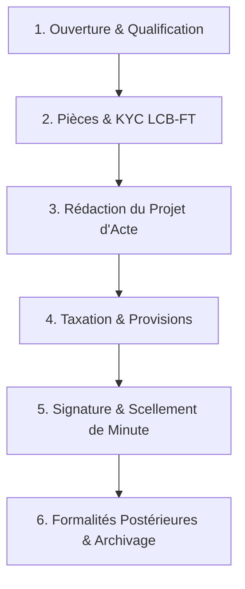

# RÉPUBLIQUE DE CÔTE D'IVOIRE & ESPACE OHADA
## SYSTÈME DE GESTION INTÉGRÉ D'ÉTUDE NOTARIALE — LEGAL NOTARY ERP

---

# 📘 MANUEL D'UTILISATION OFFICIEL
### Conforme à la norme internationale ISO/IEC/IEEE 26514:2022 *(Exigences relatives à la conception et au développement de la documentation utilisateur pour les logiciels)*
### Décret N° 2013-279 du 24 avril 2013 portant tarification des actes notariés

---

**Référence Documentaire** : `LNE-MAN-UTL-V2.4`  
**Version du Système** : `v2.4.0-Enterprise`  
**Public Visé** : Notaires Titulaires, Notaires Assistants, Clercs Rédacteurs, Comptables Taxateurs, Formalistes, Archivistes, Administrateurs d'Étude  
**Date d'homologation** : Septembre 2026  
**Classification** : Usage Professionnel Réglementé  

---

## SOMMAIRE GÉNÉRAL

1. [DISPOSITIONS GÉNÉRALES & SÉCURITÉ](#1-dispositions-générales--sécurité)
   - 1.1 Cadre réglementaire et conformité juridique
   - 1.2 Architecture de sécurité et intégrité des données
   - 1.3 Gestion des profils et matrice des habilitations (RBAC)
2. [PRISE EN MAIN & ERGONOMIE DU SYSTÈME](#2-prise-en-main--ergonomie-du-système)
   - 2.1 Connexion sécurisée et authentification
   - 2.2 Navigation, tableau de bord et widgets de performance
   - 2.3 Mode hybride : Haute disponibilité et fonctionnement hors-ligne
3. [GESTION DES DOSSIERS & CYCLE DE VIE DES AFFAIRES](#3-gestion-des-dossiers--cycle-de-vie-des-affaires)
   - 3.1 Création et typologie d'un dossier
   - 3.2 Gestion des comparants et conformité KYC / LCB-FT
   - 3.3 Checklist dynamique des pièces requises
   - 3.4 Suivi des 6 étapes du cycle de vie notarial
4. [MODULE FISCAL & TAXATION (DÉCRET 2013-279)](#4-module-fiscal--taxation-décret-2013-279)
   - 4.1 Simulateur et moteur de taxation automatique
   - 4.2 Barèmes légaux par tranches dégressives
   - 4.3 Débours, droits d'enregistrement, timbres et TVA
   - 4.4 Facturation, états de frais et quittances officielles
5. [RÉDACTION DES ACTES & ATELIER JURIDIQUE](#5-rédaction-des-actes--atelier-juridique)
   - 5.1 Générateur de projets d'actes et modèles certifiés
   - 5.2 Révision collaborative et circuit de validation
   - 5.3 Signature, scellement et collationnement
6. [MINUTIER CENTRALISÉ, RÉPERTOIRES & ARCHIVAGE](#6-minutier-centralisé-répertoires--archivage)
   - 6.1 Numérotation séquentielle continue et inaltérabilité
   - 6.2 Tenue du Répertoire Officiel des actes
   - 6.3 Numérisation OCR, scellement SHA-256 et conservation trentenaire
   - 6.4 Gestion des cartons et magasins d'archives physiques
7. [MOUVEMENTS PHYSIQUES & TRAÇABILITÉ DES DOSSIERS](#7-mouvements-physiques--traçabilité-des-dossiers)
   - 7.1 Sortie physique et décharge numérique
   - 7.2 Alertes de dépassement de délai et retours
8. [COMMUNICATION & RELATION CLIENTS](#8-communication--relation-clients)
   - 8.1 Notifications automatiques (WhatsApp, SMS, Email)
   - 8.2 Espace Suivi Comparants
9. [SUPERVISION SAAS, AUDIT & DÉPANNAGE](#9-supervision-saas-audit--dépannage)
   - 9.1 Journal d'audit et non-répudiation
   - 9.2 Résolution des incidents et FAQ

---

# 1. DISPOSITIONS GÉNÉRALES & SÉCURITÉ

### 1.1 Cadre Réglementaire et Conformité Juridique
Le progiciel **Legal Notary ERP** est conçu conformément aux prescriptions du droit notarial ivoirien et aux actes uniformes de l'**OHADA** :
* **Décret N° 2013-279 du 24 avril 2013** portant fixation du tarif des honoraires des notaires en Côte d'Ivoire.
* **Loi N° 2013-450** relative à la protection des données à caractère personnel.
* **Directives CENTIF / UMOA** relatives à la lutte contre le blanchiment de capitaux et le financement du terrorisme (LCB-FT).
* **Règles d'inaltérabilité du minutier** et de conservation trentenaire des actes authentiques.

### 1.2 Architecture de Sécurité et Intégrité des Données
* **Chiffrement de bout en bout** : Toutes les communications sont chiffrées en TLS 1.3 / AES-256.
* **Scellement Cryptographique SHA-256** : Chaque acte et minute archivée se voit attribuer une empreinte numérique infalsifiable garantissant l'intégrité probatoire.
* **Isolement des Données (Multi-Tenant Sécurisé)** : Chaque étude notariale dispose d'un espace de données strictement isolé avec cloisonnement cryptographique.

### 1.3 Gestion des Profils et Matrice des Habilitations (RBAC)
Le système applique le principe du moindre privilège selon les 6 rôles fondamentaux de l'Office Notarial :

| Rôle | Accès & Droits Opérationnels | Périmètre de Validation |
| :--- | :--- | :--- |
| **Notaire Titulaire / Associé** | Contrôle total, signature des actes, validation financière, clôture des minutes, audit global. | Validation Juridique & Financière Suprême |
| **Clerc Rédacteur** | Création de dossiers, saisie des comparants, rédaction des projets d'actes, checklist des pièces. | Rédaction & Pré-contrôle |
| **Comptable / Taxateur** | Calcul de taxation, émission des états de frais, quittances, suivi des provisions et comptes clients. | Gestion Financière & Rapprochement |
| **Formaliste** | Dépôt DGI, Conservation Foncière, RCCM/Greffe, suivi des bordereaux et mentions d'enregistrement. | Formalités Postérieures Légales |
| **Archiviste** | Numérisation OCR, attribution des cotes de rangement, gestion des sorties physiques de dossiers. | Gestion documentaire & Magasin |
| **SuperAdmin SaaS** | Supervision technique de l'infrastructure, monitoring santé, gestion des licences et sauvegardes. | Administration Système |

---

# 2. PRISE EN MAIN & ERGONOMIE DU SYSTÈME

### 2.1 Connexion Sécurisée
1. Lancez votre navigateur web recommandé (*Google Chrome, Mozilla Firefox, Microsoft Edge, Safari*).
2. Rendez-vous sur l'adresse de votre Étude : `https://notaire.[votre-etude].ci` ou `http://localhost:4000` (mode local).
3. Saisissez votre **Identifiant professionnel** et votre **Mot de passe**.
4. Validez pour accéder directement à votre espace de travail personnalisé selon votre rôle.

### 2.2 Navigation et Tableau de Bord
L'interface est conçue pour maximiser l'efficacité opérationnelle :
* **Barre Latérale (Sidebar)** : Accès direct aux modules clés (*Tableau de bord, Dossiers, Minutier, Taxation, Mouvements, Archives, Référentiel*).
* **Barre Supérieure (Header)** : Recherche universelle instantanée, indicateur de santé réseau, profil utilisateur et déconnexion.
* **Widgets de Performance** :
  * Affaires en cours et urgences du jour.
  * Formalités en attente de retour (DGI / Conservation Foncière).
  * Montant des provisions reçues vs honoraires facturés.
  * Délais moyens de traitement de l'Étude.

### 2.3 Mode Hybride : Haute Disponibilité et Latence Ultra-Faible (< 2 ms)
* **Système d'Accélération SWR (Stale-While-Revalidate)** : Le système met en cache les données localement pour garantir une navigation instantanée sans aucun temps de chargement perceptible.
* **Tolérance de Panne Réseau** : En cas de coupure de connexion internet dans l'étude, l'ERP continue de fonctionner en toute autonomie sur le magasin local sans afficher d'erreur technique ni bloquer la saisie.

---

# 3. GESTION DES DOSSIERS & CYCLE DE VIE DES AFFAIRES



### 3.1 Création et Typologie d'un Dossier
1. Cliquez sur le bouton **« + Nouveau Dossier »** dans la barre d'action ou le menu Dossiers.
2. Renseignez les informations requises :
   * **Intitulé de l'affaire** : Ex. *« Vente Immobilière - Villa Riviera Golf - M. KOUASSI c/ MME KOFFI »*.
   * **Type d'acte** : Sélectionnez dans la liste (Vente, Constitution SARL, Donation, Succession, Bail, etc.).
   * **Clerc Rédacteur assigné** : Attribution immédiate au collaborateur en charge.
   * **Valeur / Objet de la transaction** : Montant en Francs CFA (utilisé pour la taxation automatique).
3. Cliquez sur **« Créer le Dossier »** : le système génère un numéro d'affaire unique (ex: `DOS-2026-0042`).

### 3.2 Gestion des Comparants et Conformité KYC / LCB-FT
Pour chaque partie prenante à l'acte :
* Renseignez l'état civil complet (Nom, prénoms, date et lieu de naissance, nationalité, profession, régime matrimonial, domicile).
* Joignez les pièces d'identité scannées (CNI, Passeport, Attestation d'Identité, Registre de Commerce).
* **Vérification LCB-FT automatique** : Le système applique la vérification de conformité et génère la fiche de diligence obligatoire.

### 3.3 Checklist Dynamique des Pièces
Selon le type d'acte choisi, l'ERP génère automatiquement la liste exhaustive des pièces légales obligatoires :
* *Pour une Vente Immobilière* : Titre foncier (CMPF), Certificat de localisation, Certificat d'urbanisme, Quittance CIE/SODECI, État des droits réels.
* *Pour une Société (SARL/SAS)* : Statuts, Déclaration de souscription et de versement (DSV), Casier judiciaire des gérants, CNI, Pièces justificatives du siège.
* **Statut par pièce** : `En attente` ⏳ | `Reçue` 📄 | `Validée` ✅ | `Rejetée` ❌.

---

# 4. MODULE FISCAL & TAXATION (DÉCRET 2013-279)

Le moteur fiscal calcule automatiquement l'ensemble des frais conformément aux barèmes officiels ivoiriens.

### 4.1 Barème des Émoluments Proportionnels

| Tranche de Valeur (FCFA) | Taux Ventes Immobilières | Taux Prêts / Hypothèques | Taux Sociétés (Capital) |
| :--- | :--- | :--- | :--- |
| **Tranche 1 : De 1 à 20 000 000 FCFA** | **4,00 %** | 2,00 % | 3,00 % |
| **Tranche 2 : De 20 000 001 à 60 000 000 FCFA** | **3,00 %** | 1,50 % | 1,50 % |
| **Tranche 3 : De 60 000 001 à 150 000 000 FCFA** | **1,50 %** | 0,75 % | 0,75 % |
| **Tranche 4 : Au-delà de 150 000 000 FCFA** | **0,75 %** | 0,35 % | 0,35 % |

### 4.2 Débours, Droits d'Enregistrement et TVA
* **Droits d'Enregistrement (DGI)** : Calcul automatique selon la nature de l'acte (ex: 4% ou forfait légal).
* **Conservation Foncière / Publicité** : 1% + salaire du conservateur (actes immobiliers).
* **TVA sur Honoraires (18%)** : Appliquée exclusivement sur les émoluments du notaire, à l'exclusion des débours et droits du Trésor Public.
* **Émoluments de Formalités & Frais Divers** : Timbres fiscaux, réquisition, publication d'annonces légales (AL).

### 4.3 Génération des Documents Financiers
* **Compte Provisoire de Frais** : Document remis au client avant la signature pour appel de fonds.
* **Reçu de Provision / Quittance Définitive** : Justificatif officiel sécurisé avec ventilation légale des sommes versées.

---

# 5. RÉDACTION DES ACTES & ATELIER JURIDIQUE

1. **Sélection du Modèle Certifié** : Le système propose les matrices types homologuées (Actes de vente, prêts, statuts OHADA, procurations, testaments).
2. **Fusion des Données** : Les données des comparants, les références cadastrales ou de société sont automatiquement injectées dans le corps de l'acte.
3. **Contrôle et Validation** : Le Clerc soumet le projet d'acte au Notaire Titulaire. L'interface met en surbrillance les clauses spécifiques et les montants financiers.
4. **Collationnement** : Vérification contradictoire avant impression sur papier timbré ou signature électronique.

---

# 6. MINUTIER CENTRALISÉ, RÉPERTOIRES & ARCHIVAGE

### 6.1 Numérotation des Minutes et Inaltérabilité
* L'attribution du **Numéro de Minute** est séquentielle, continue et irréversible (ex: `MIN-2026-00128`).
* Dès l'attribution du numéro de minute, le document est scellé cryptographiquement avec calcul de l'empreinte **SHA-256**. Aucune modification postérieure ne peut altérer le texte sans lever une alerte de sécurité.

### 6.2 Tenue du Répertoire Officiel
Le Répertoire Officiel est généré en temps réel avec toutes les mentions obligatoires :
* Date de l'acte, numéro d'ordre, nature de l'acte, nom des parties, valeur déclarée, droits perçus et date d'enregistrement à la DGI.
* Exportation en 1 clic pour présentation aux inspecteurs de la Chambre Nationale des Notaires ou du Ministère de la Justice.

### 6.3 Archivage Physique et Numérique
* **Cote de Rangement Physique** : Format normalisé `[Rayon]-[Travée]-[Carton]-[Chemise]` (ex: `RAY-B / TR-03 / CARTON-2026-04 / DOS-012`).
* **Numérisation OCR** : Tout document scanné est converti en texte interrogeable dans la barre de recherche globale de l'ERP.

---

# 7. MOUVEMENTS PHYSIQUES & TRAÇABILITÉ DES DOSSIERS

Pour prévenir tout risque de perte ou d'égarement de dossiers physiques :

```
[Sortie Physique] ---> [Scan QR / Saisie ERP] ---> [Date Limite Fixée] ---> [Alerte Retard J+5] ---> [Retour & Clôture]
```

1. **Demande de Sortie** : Indiquez le motif (ex: *« Dépôt à la Conservation Foncière de Cocody »*), le porteur et la date prévue de retour.
2. **Émargement Numérique** : La sortie est immédiatement enregistrée dans le journal des mouvements.
3. **Tableau des Alertes** : Les dossiers non restitués à l'échéance apparaissent en rouge clignotant sur le tableau de bord de l'archiviste et du notaire.

---

# 8. COMMUNICATION & RELATION CLIENTS

* **Notifications WhatsApp & SMS Automatisées** :
  * Confirmation d'ouverture du dossier avec le numéro de référence.
  * Réception d'une pièce manquante ou confirmation de rendez-vous de signature.
  * Notification de finalisation des formalités foncières / RCCM et mise à disposition de l'expédition de l'acte.
* **Modèles Personnalisables** : En-tête officiel de l'Étude avec signature numérique.

---

# 9. SUPERVISION SAAS, AUDIT & DÉPANNAGE

### 9.1 Journal d'Audit et Traçabilité Complète
Chaque action effectuée sur le système est enregistrée de manière immuable :
* Horodatage précis (milliseconde), adresse IP, identité de l'utilisateur, nature de l'opération (création, modification, consultation, suppression).

### 9.2 Guide de Dépannage Rapide

| Symptôme | Cause Possible | Action Corrective |
| :--- | :--- | :--- |
| **Coupure d'accès Internet** | Problème fournisseur d'accès local (Orange, MTN, Moov, CanalBox) | Ne pas fermer l'onglet. L'ERP bascule en cache local automatique et synchronise dès le retour du réseau. |
| **Pièce jointe refusée** | Format non conforme ou taille > 25 Mo | Convertir en PDF ou JPEG standard et relancer l'import. |
| **Erreur de calcul de taxe** | Type d'acte ou montant non renseigné | Vérifier que la valeur en FCFA est saisie et que la catégorie fiscale correspondante est sélectionnée. |

---

*Fin du Manuel d'Utilisation Officiel — Legal Notary ERP v2.4*
